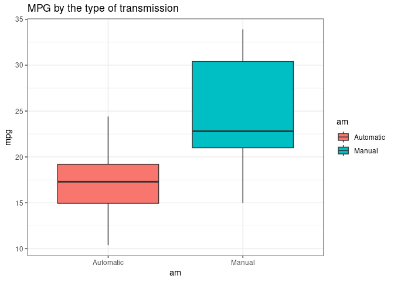

#### Executive Summary

This report represents the analysis the relationship between some
variables and MPG (miles per gallon) with using the mtcars dataset. In
order to determine the important variables, regression models are used.
You can see my report at the following site:
<https://rpubs.com/tommat2022/motor_trend>  
The main questions are following:  
- Which is better for MPG, an automatic or manual transmission?  
- Evaluate the the difference of the effect on MPG between an automatic
and manual transmission.

At the beginning, I performed a boxplot and t-test to evaluate the basic
statistical analysis, which shows that the type of transmission is
significantly related with the MPG.  
Next, I performed the simple linear regression methond to identify how
much the type of transmission explains the change of MPG. According to
the regression, only 34% can be explained by using the type of
transmission. Finally, I performed the multiple linear regression method
to identify which variables are important to determine the change of
MPG. According to the multiple regression, the number of cylinders are
the most important factors to determine the change of MPG. The second
important factor is the weight of car. The multiple regression model is
a good model base on the residuals analysis.

#### Load Library and Data Cleansing

    suppressMessages(library(ggplot2))
    suppressMessages(library(dplyr))
    suppressMessages(library(tidyr))
    data(mtcars)
    mtcars$cyl <- as.factor(mtcars$cyl)
    mtcars$vs <- as.factor(mtcars$vs)
    mtcars$am <- as.factor(mtcars$am)
    levels(mtcars$am) <- c("Automatic", "Manual")
    mtcars$gear <- as.factor(mtcars$gear)
    mtcars$carb <- as.factor(mtcars$carb)
    head(mtcars)

    ##                    mpg cyl disp  hp drat    wt  qsec vs        am gear carb
    ## Mazda RX4         21.0   6  160 110 3.90 2.620 16.46  0    Manual    4    4
    ## Mazda RX4 Wag     21.0   6  160 110 3.90 2.875 17.02  0    Manual    4    4
    ## Datsun 710        22.8   4  108  93 3.85 2.320 18.61  1    Manual    4    1
    ## Hornet 4 Drive    21.4   6  258 110 3.08 3.215 19.44  1 Automatic    3    1
    ## Hornet Sportabout 18.7   8  360 175 3.15 3.440 17.02  0 Automatic    3    2
    ## Valiant           18.1   6  225 105 2.76 3.460 20.22  1 Automatic    3    1

#### Exploratory Data Analysis

    mtcars %>% 
      ggplot(aes(x=am, y=mpg, fill=am)) +
      geom_boxplot() +
      ggtitle("MPG by the type of transmission") +
      theme_bw()

#### T-test analysis

In order to determine whether the type of transmission is significantly
different, I performed t-test.  
The t-test shows significantly different between the two type of
transmission with the p-value is less than 0.05.

    compare_transmission <- t.test(mpg ~ am, data=mtcars)
    compare_transmission

    ## 
    ##  Welch Two Sample t-test
    ## 
    ## data:  mpg by am
    ## t = -3.7671, df = 18.332, p-value = 0.001374
    ## alternative hypothesis: true difference in means between group Automatic and group Manual is not equal to 0
    ## 95 percent confidence interval:
    ##  -11.280194  -3.209684
    ## sample estimates:
    ## mean in group Automatic    mean in group Manual 
    ##                17.14737                24.39231

#### Simple Linear Regression analysis

I performed the simple linear regression method in the model with MPG as
dependent variable and type of transmission as independent variable.
According to the simple linear regression analysis, I can say that the
type of transmission is significantly related with the MPG. Adjusted
R-sauared is 0.3385, therefore the type of transmission only explain the
34% of variance.

    simple_lm <- lm(mpg ~ am, data=mtcars)
    summary(simple_lm)

    ## 
    ## Call:
    ## lm(formula = mpg ~ am, data = mtcars)
    ## 
    ## Residuals:
    ##     Min      1Q  Median      3Q     Max 
    ## -9.3923 -3.0923 -0.2974  3.2439  9.5077 
    ## 
    ## Coefficients:
    ##             Estimate Std. Error t value Pr(>|t|)    
    ## (Intercept)   17.147      1.125  15.247 1.13e-15 ***
    ## amManual       7.245      1.764   4.106 0.000285 ***
    ## ---
    ## Signif. codes:  0 '***' 0.001 '**' 0.01 '*' 0.05 '.' 0.1 ' ' 1
    ## 
    ## Residual standard error: 4.902 on 30 degrees of freedom
    ## Multiple R-squared:  0.3598, Adjusted R-squared:  0.3385 
    ## F-statistic: 16.86 on 1 and 30 DF,  p-value: 0.000285

#### Multiple Linear Regression analysis

I performed multiple linear regression method in the model with MPG as
dependent variable and all other variables as independent variables.  
Accoding to the multiple linear regression, I can say that the type of
transmission is not significant when the other variables are considered
at the same time. The number of cylinders are much more significant than
other variables. The second important variable is the weight of car.

    multi_lm <- lm(mpg ~ cyl + disp + wt + am, data=mtcars)
    summary(multi_lm)

    ## 
    ## Call:
    ## lm(formula = mpg ~ cyl + disp + wt + am, data = mtcars)
    ## 
    ## Residuals:
    ##     Min      1Q  Median      3Q     Max 
    ## -4.5029 -1.2829 -0.4825  1.4954  5.7889 
    ## 
    ## Coefficients:
    ##              Estimate Std. Error t value Pr(>|t|)    
    ## (Intercept) 33.816067   2.914272  11.604 8.79e-12 ***
    ## cyl6        -4.304782   1.492355  -2.885  0.00777 ** 
    ## cyl8        -6.318406   2.647658  -2.386  0.02458 *  
    ## disp         0.001632   0.013757   0.119  0.90647    
    ## wt          -3.249176   1.249098  -2.601  0.01513 *  
    ## amManual     0.141212   1.326751   0.106  0.91605    
    ## ---
    ## Signif. codes:  0 '***' 0.001 '**' 0.01 '*' 0.05 '.' 0.1 ' ' 1
    ## 
    ## Residual standard error: 2.652 on 26 degrees of freedom
    ## Multiple R-squared:  0.8376, Adjusted R-squared:  0.8064 
    ## F-statistic: 26.82 on 5 and 26 DF,  p-value: 1.73e-09

#### Residuals analysis

According the residuals vs fitted chart and scale-location chart, the
assumption of independence and the constance variance can be said.
According to the Normal Q-Q plot, the distribution of residuals is
almost normal. According to the residualsvs leverage plot, all of the
point are within the 0.05 lines, so I can say that there is no outliers.

    par(mfrow=c(2,2))
    plot(multi_lm)

#### Conclusion

I performed a boxplot and t-test to evaluate the basic statistical
analysis, which shows that the type of transmission is significantly
related with the MPG.  
Next, I performed the simple linear regression methond to identify how
much the type of transmission explains the change of MPG. According to
the regression, only 34% can be explained by using the type of
transmission. Finally, I performed the multiple linear regression method
to identify which variables are important to determine the change of
MPG. According to the multiple regression, the number of cylinders are
the most important factors to determine the change of MPG. The second
important factor is the weight of car. The multiple regression model is
a good model base on the residuals analysis.
